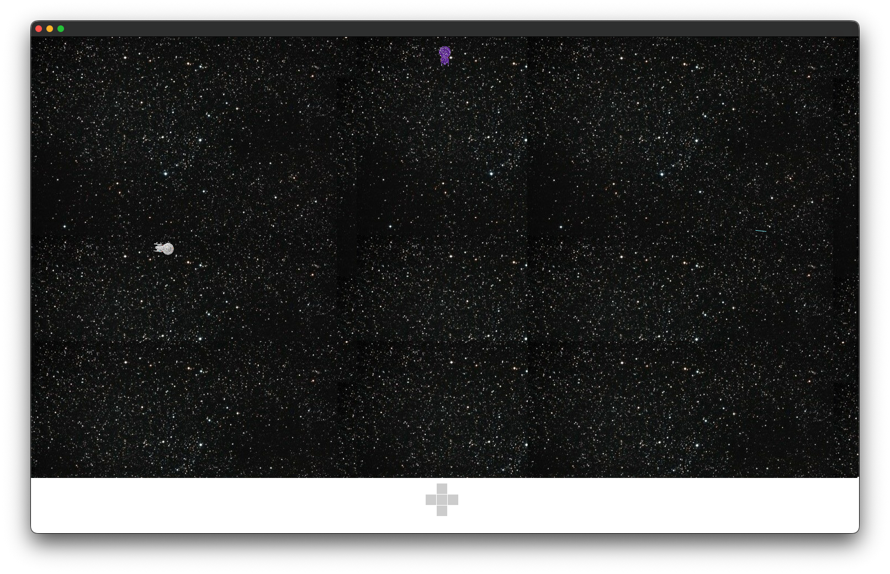
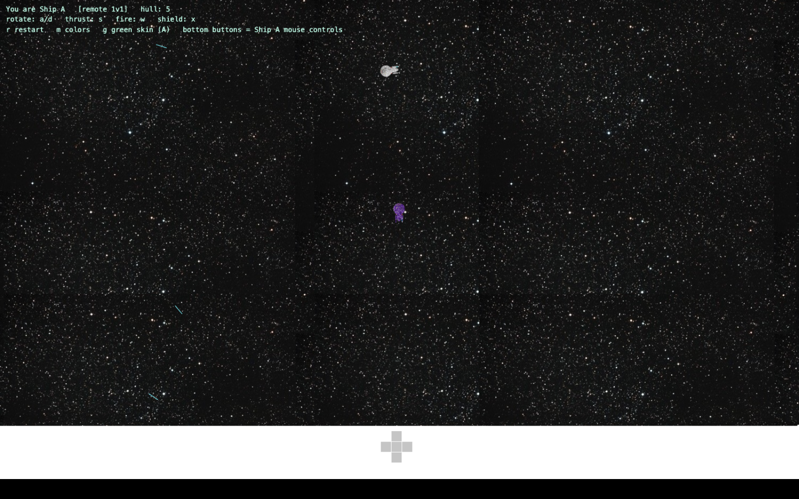
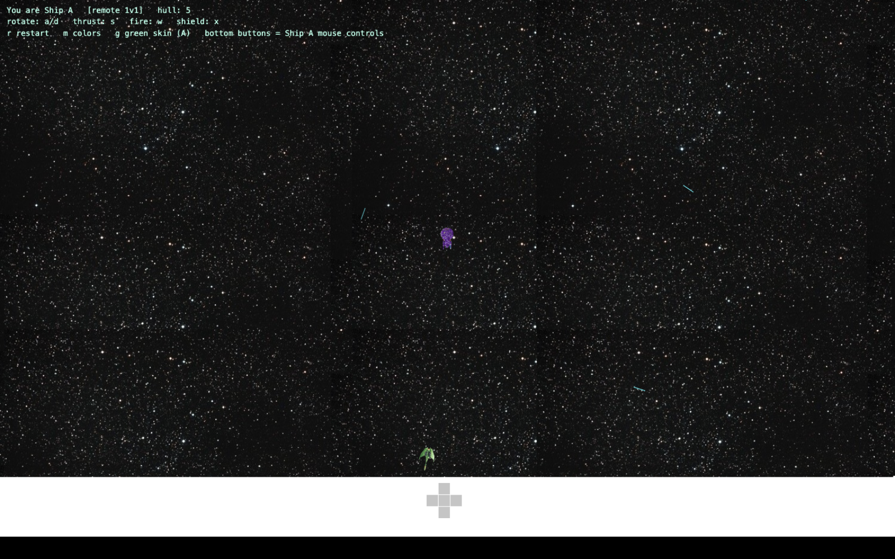
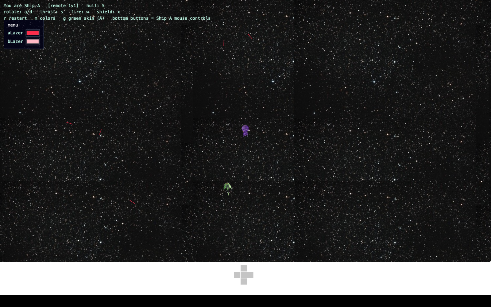

== StarShips ==

In remembrance of playing a star ship game with my father on an old pre-dos IBM machine. This was recreated with it in mind. 

== Implementation ==

Initially prototyped with Processing, OpenFrameworks was selected for performance reasons, and it paid off because I could not get the keyboard driven rotation working with processing. 

== Developing ==

Ensure openFrameworks 0.12.1 is installed to ~/lib on macOS (NOT ~/.local — the oF makefiles silently drop /. paths) and code is checked out to ~/someworkspace/<starships>. `make` builds; see BUILD-arm64.md for the full recipe, and web/README.md for the web version.

== Screenshots ==

Native (openFrameworks, arm64):

Web remake (browser, LAN 1v1):

The Bird-of-Prey skin (press g — Ship A):

Lazer-color menu (press m), recoloring in-flight lazers:

== License ==

Apache License 2.0 — see LICENSE.

== End of Life ==

End of life will be declared when basic colors, sounds, 2 player features enabled. Anything beyond that, and a port to unity 3D is likely. 

== 2026 Update ==

I asked an AI coding tool to take a look at this project to re-compile for arm64, and wouldn't it be nice if there was a web/lan version - it then went ahead and built it and then turned around and said it was a trivial thing - a shoot lazers from a couch kind of thing. I am both impressed and insulted. 

So, C++ me, web - well, thank Z.ai for that one. 
